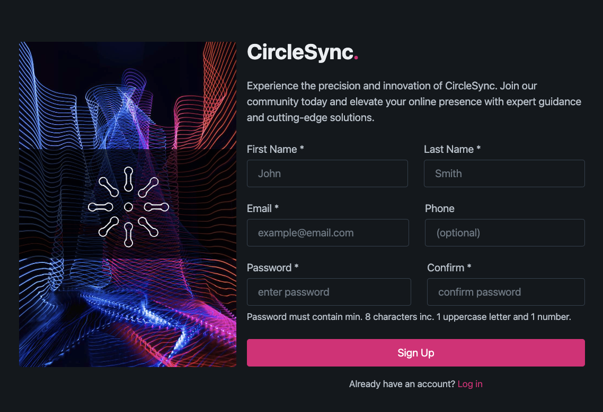

# Sign Up Form #

  

  

  <a href="https://scottwright-dev.github.io/odin-project-sign-up/">CLICK HERE FOR DEMO</a>

### Description
To create a website sign-up form for a fictitious brand using HTML, CSS and JavaScript for password validation. Using the HTML form element to create a user-friendly and accessible web form for client-side data submission.

### Technologies used:
- HTML
- CSS
- JavaScript
- Pico.css
- Sass

### Features

- Password form validation via JavaScript.
- Responsive design for desktop and mobile.

### Challenges

- implementing the JavaScript validation for the password fields.
- Ensuring the form was accessible required me to carefully consider the use of semantic HTML and aria tags for screen readers.
- Creating a responsive design for mobile devices.

### Thoughts and Observations

The brief afforded me flexibility in terms of design and technologies so I used this project as an opportunity to explore CSS frameworks and preprocessors. I selected PicoCSS due to its lightweight form and the ability to customise further. 

Using SASS allowed me to create a streamlined custom version of PicoCSS, extracting only the necessary modules which gave me hands-on experience using these technologies and techniques. 

I remained mindful of accessibility concerns during the development process and implemented measures to provide helpful feedback both visually via CSS as well as to assistive technologies such as screen readers via well-structured,  semantic HTML using aria tags and proper labelling of elements. 

 
### Credits
Image by: <a href="https://unsplash.com/@zaks">Zak @ Unsplash</a>
